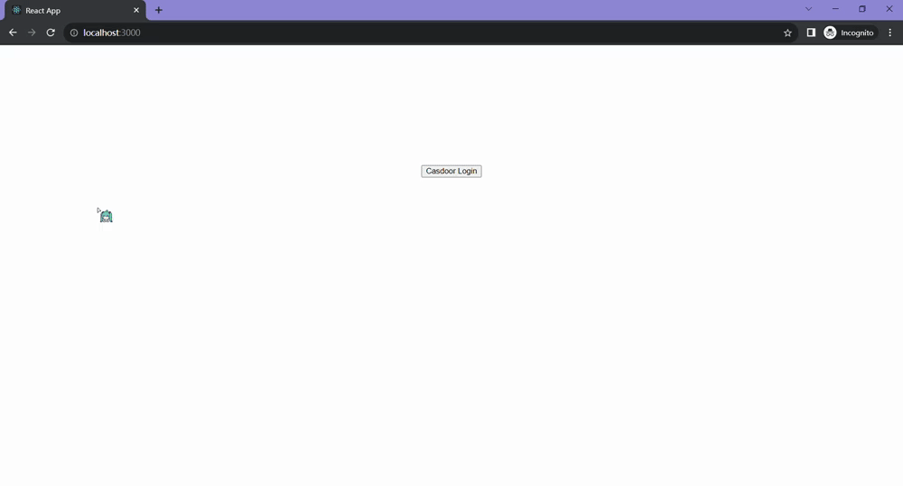

# Casdoor Go + React Example

[](https://github.com/casdoor/casdoor-go-react-example/actions/workflows/build.yml)
[](https://github.com/casdoor/casdoor-go-react-example/blob/master/LICENSE)
[](https://discord.gg/5rPsrAzK7S)

An example web app that signs users in with [Casdoor](https://casdoor.ai/), with a React frontend and a Go backend.

| Part     | SDK                                                                                                                         | Language           | Port |
|----------|-----------------------------------------------------------------------------------------------------------------------------|--------------------|------|
| Frontend | [casdoor-react-sdk](https://github.com/casdoor/casdoor-react-sdk), [casdoor-js-sdk](https://github.com/casdoor/casdoor-js-sdk) | JavaScript + React | 3000 |
| Backend  | [casdoor-go-sdk](https://github.com/casdoor/casdoor-go-sdk)                                                                 | Go                 | 8080 |



## How it works

1. The frontend redirects the user to the Casdoor sign-in page (`CasdoorSdk.getSigninUrl()`).
2. After signing in, Casdoor redirects back to `http://localhost:3000/callback` with `code` and `state`.
3. The `AuthCallback` component of casdoor-react-sdk sends them to the backend: `GET /api/signin?code=...&state=...`.
4. The backend exchanges the code for an access token with `casdoorsdk.GetOAuthToken()` and returns it. The frontend keeps it in `localStorage`.
5. The frontend calls `GET /api/userinfo` with `Authorization: Bearer <token>`. The backend verifies the token with `casdoorsdk.ParseJwtToken()` and returns the user in it.
6. With the same token, the frontend also calls Casdoor's `get-users` API directly, as the signed-in user.

The backend APIs are in [handler.go](handler.go), the frontend calls are in [web/src/Setting.js](web/src/Setting.js).

## Prerequisites

- Go 1.23+
- Node.js 18+ and Yarn
- A Casdoor server. The example is preconfigured for the public demo server https://door.casdoor.com, so it runs as is. To use your own, see [Casdoor installation](https://casdoor.ai/docs/basic/server-installation).

## Configuration

Skip this section to try the example with the public demo server.

In your Casdoor, create (or reuse) an organization and an application, and add `http://localhost:3000/callback` to the application's **Redirect URLs**. Then fill in both parts:

### Frontend

[web/src/Conf.js](web/src/Conf.js):

```js
export const sdkConfig = {
  serverUrl: "https://door.casdoor.com", // Casdoor server URL
  clientId: "294b09fbc17f95daf2fe", // client ID of the application
  organizationName: "casbin", // organization of the application
  appName: "app-vue-python-example", // name of the application
  redirectPath: "/callback",
};
```

### Backend

[app.yaml](app.yaml):

```yaml
# the certificate of the cert used by the application: Casdoor -> Certs -> the cert -> Certificate
certificate: |
  -----BEGIN CERTIFICATE-----
  ...
  -----END CERTIFICATE-----
server:
  endpoint: "https://door.casdoor.com" # Casdoor server URL
  client_id: "294b09fbc17f95daf2fe" # client ID of the application
  client_secret: "dd8982f7046ccba1bbd7851d5c1ece4e52bf039d" # client secret of the application
  organization: "casbin" # organization of the application
  application: "app-vue-python-example" # name of the application
  frontend_url: "http://localhost:3000" # frontend URL
```

## Run

```shell
git clone https://github.com/casdoor/casdoor-go-react-example
cd casdoor-go-react-example
```

Backend, at http://localhost:8080:

```shell
go run .
```

Frontend, at http://localhost:3000:

```shell
cd web
yarn install
yarn start
```

Open http://localhost:3000 and click **Casdoor Login**.

## Resources

- [Casdoor documentation](https://casdoor.ai/docs/overview)
- [casdoor-go-sdk](https://github.com/casdoor/casdoor-go-sdk)
- [casdoor-react-sdk](https://github.com/casdoor/casdoor-react-sdk)

## License

[Apache-2.0](LICENSE)
